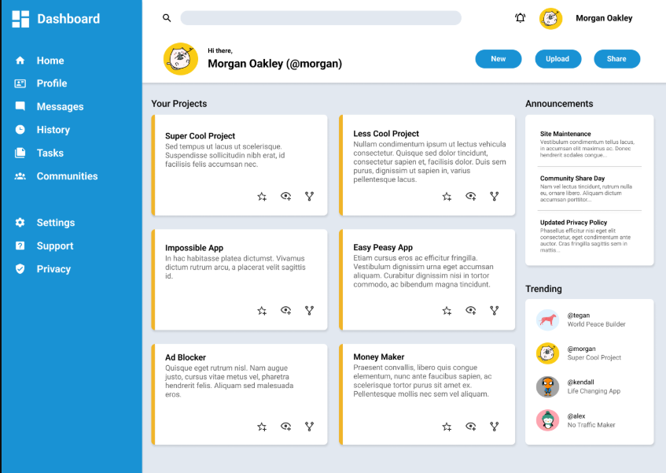

# Admin DashBoard

## Description

This is a front-end Admin Dashboard built using HTML, CSS, and CSS Grid.  
It was created as part of The Odin Project curriculum to practice **advanced layout techniques using CSS Grid**.

For more information about this project and my learning journey, please visit:  
[The Odin Project](https://www.theodinproject.com/lessons/node-path-intermediate-html-and-css-admin-dashboard)

---

## Live Demo

👉 [Click here to view the live demo](https://edehify.github.io/Admin-DashBoard/)

---

## Screenshot

---

## Features

* Dashboard sidebar navigation
* Search bar in the header
* Project cards layout
* Announcement section
* Trending users panel

---

## Built With

* HTML5
* CSS3
* CSS Grid

---

## What I Learned

While building this project I learned:

* How to structure complex layouts
* How to use CSS Grid for 2D layouts
* How to organize UI components
* How to manage project files properly

---

## Project Structure

Example:

Admin-DashBoard
│
├── index.html
├── css/style.css
├── font/Roboto
└── images

---

## Future Improvements

* Add mobile responsiveness
* Add JavaScript interactivity
* Improve UI design

---

## Acknowledgements

This project was completed as part of the curriculum from The Odin Project.

## Author

**Edeh Maligue Ifeanyi**
